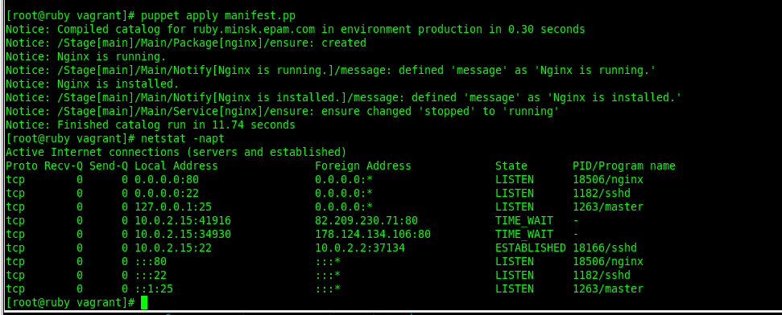
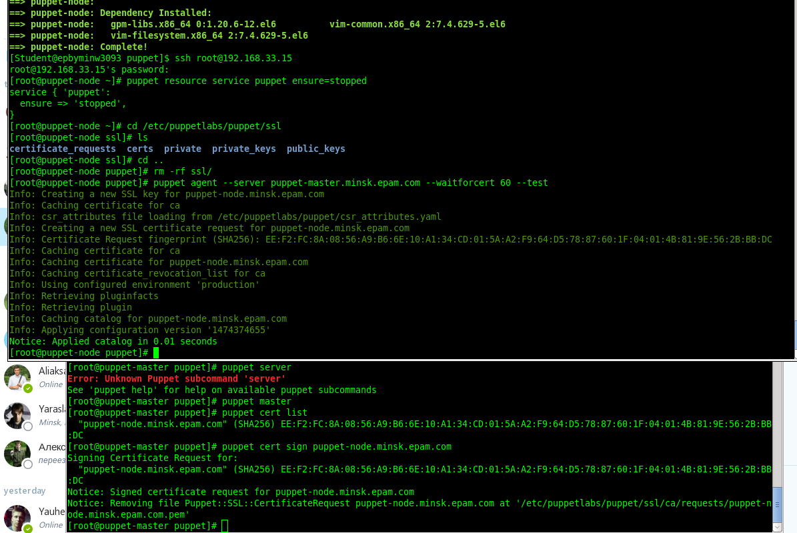
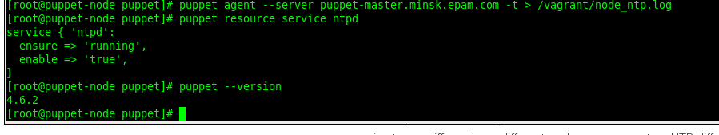

# lesson11

***Student***: [Aliaksei Khurhin](https://epa.ms/1Cqi0K)

All work was done on vagrant vm's, [Vagrantfile](Vagrantfile) with basic configuration is provided.

Here is the result of applying basic manifest from the task (nginx) with Puppet Standalone:

Connecting node to master:

additional configuration to apply (/etc/hosts) is specified in Vagrantfile.

Command to install NTP module:
puppet module install puppetlabs-ntp

[Here](site.pp) you can see the manifest file and [logfile](node_ntp.log)

The result on the node:

